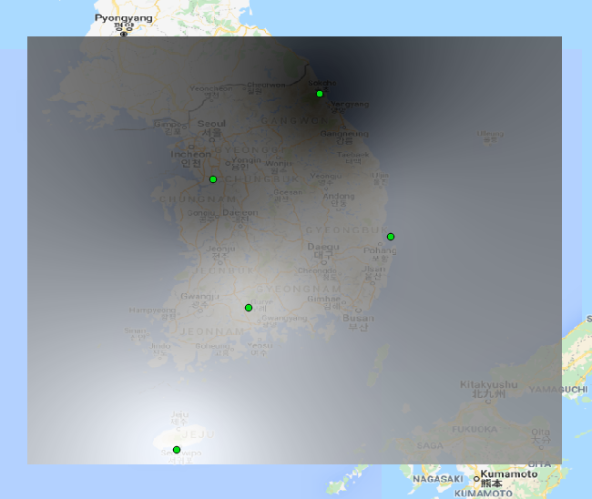

# lwu3_idw

Bash script and template/sample data to rasterize scattered points using `IDW` algorithm.

## Prerequisites

* `gdal`>=2.2.3


## Usage

### Input data.

입력 파일을 헤더 `lon,lat,value` 를 포함한 `.csv` 형식으로 준비합니다.

* 샘플 데이터 [data.csv](data.csv) 내용.
```bash
lon,lat,value
128.5,38.2,10
127.0,37.0,20
129.5,36.2,30
127.5,35.2,40
126.5,33.2,50
```

### 명령 실행.

명령어 형식 은 `bash run <resolution> <left> <bottom> <right> <top> <output_file_path>` 입니다.

#### 사용예 1

`평택(좌하:127,37)~춘천(우상:128,38)`의 영역을 해상도 `0.01°`(약 `1km` 해상도) 로 출력합니다.

```bash
bash run 0.01 127 37 128 38 output.tiff
```

#### 사용예 2

`남한 전체` 영역을 해상도 `0.001°`(약 `100m` 해상도) 로 출력합니다.

```bash
export resolution=0.001
export left=124.4
export bottom=33.0
export right=131.9
export top=39.0
export output=output.tiff
bash run $resolution $left $bottom $right $top $output
```

출력 결과




#### 이미지 출력

##### HTTP Request를 이용한 이미지 파일 저장

```bash
curl "http://10.8.11.254/mapserver/?SERVICE=WMS&VERSION=1.3.0&REQUEST=GetMap&FORMAT=image%2Fpng&TRANSPARENT=true&map=/tmp/test.map&data=/tmp/abc.tiff&layers=default,SGG_OUTLINE&WIDTH=2048&HEIGHT=2048&CRS=EPSG%3A3857&STYLES=&BBOX=13914936.3491592,3895303.96339389,14471533.8031256,4709425.8128701" > output.png
```


#### 기타 명령


##### 마스킹

`/tmp/sgg.simplified.5.shp` 파일을 이용하여 마스킹을 수행하고 마스킹된 값을 `-9999`로 채웁니다. `-9999` 값은 nodata가 됩니다.

```bash
gdalwarp -overwrite -cutline /tmp/sgg.simplified.5.shp /tmp/abc.tiff /tmp/abc2.tiff -crop_to_cutline -dstnodata -9999
```

